# Mercaprójimo
Se trata una práctica que hice en el grado. Los usuarios pueden ponerse en contacto para comprar o vender objetos de segunda mano.

La lógica consiste en que el usuario particular publica el anuncio, y de la misma forma en que puede publicar su anuncio, puede contactar con otros usuarios que han publicado un anuncio mostrando su interés por el producto.

La comunicación se realiza en la propia web a través de chat.

## Lenguajes y tecnologías
Esta hecha con: PHP, HTML5, CSS3, JS, MySQL y Bootstrap

## Vistas del sitio:

Inicio

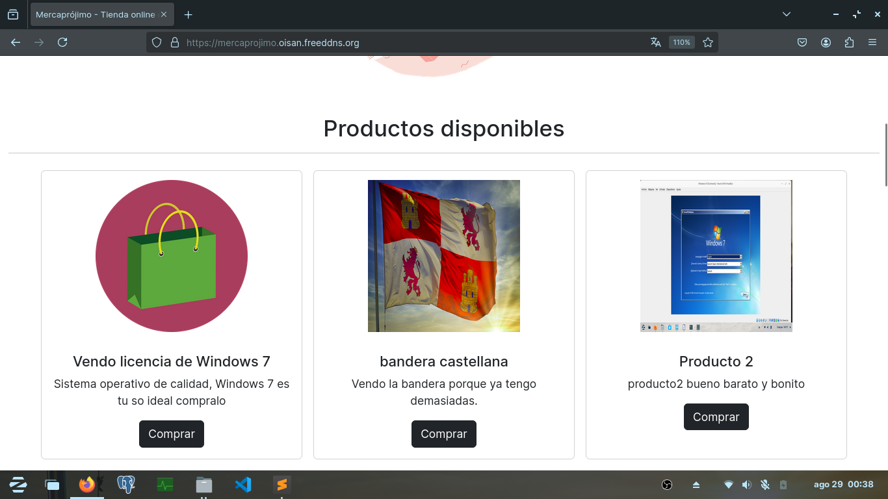

Menú
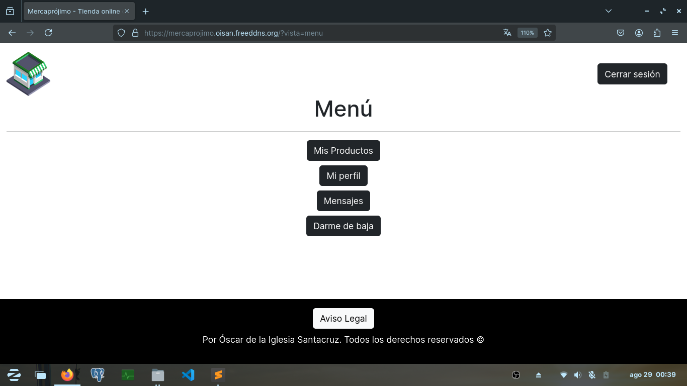

Productos añadidos
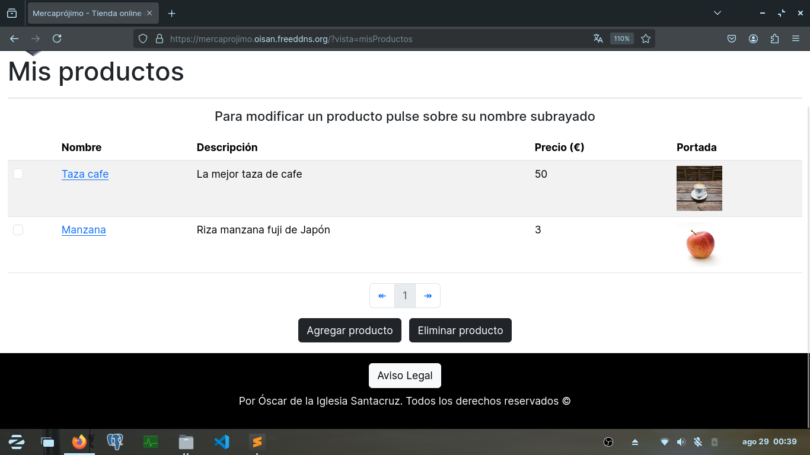

Perfil
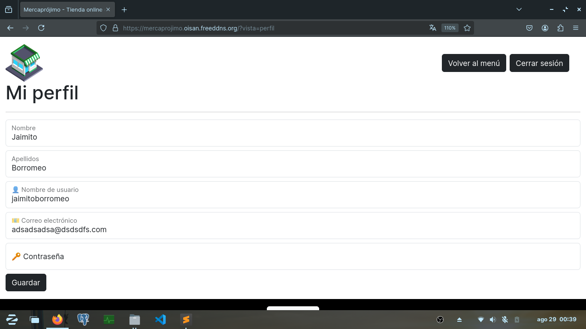

Lista de chats

Chat con un usuario

Aviso Legal

Registro

Inicio de sesión
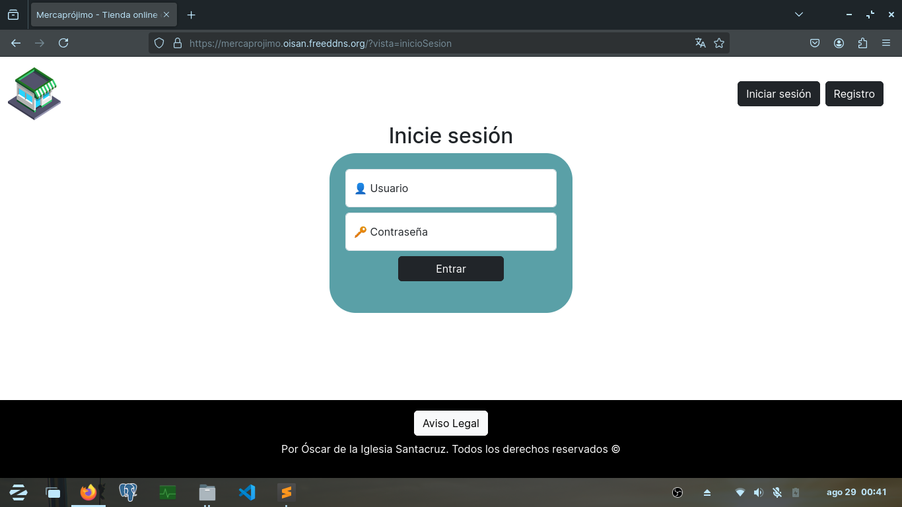

## Vídeos demostración del sitio:
Vista como particular comprador (o interesado)
[Ver video](vid/1.mp4)

Vista como particular vendedor
[Ver video](vid/2.mp4)

## URL con acceso limitado:
https://mercaprojimo.oisan.freeddns.org

## Muestras del código:

index.php
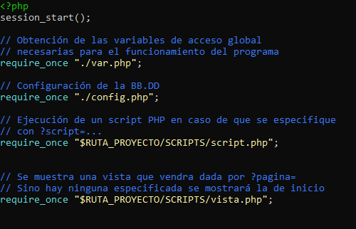

var.php
El archivo donde se encuentran las variables de acceso común
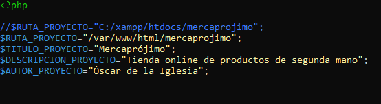

Mensaje.php
Es el modelo para la creación de objetos Mensaje
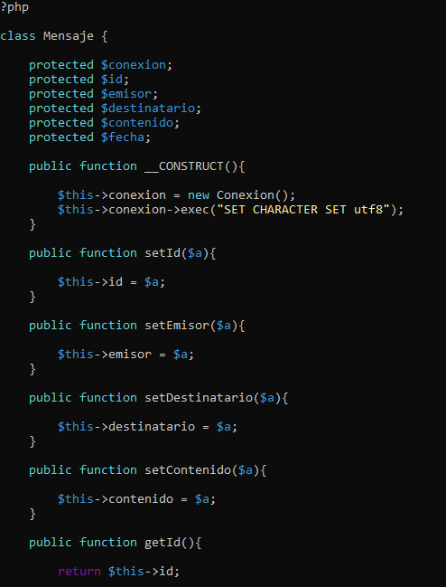

Usuario.php
Es el modelo para la creación de objetos Usuario.
Las funciones que aparecen son para crear usuarios en la BBDD y eliminarlos respetando los principios ACID (active = 0)
Y utilizando sentencias preparadas por motivos de seguridad.
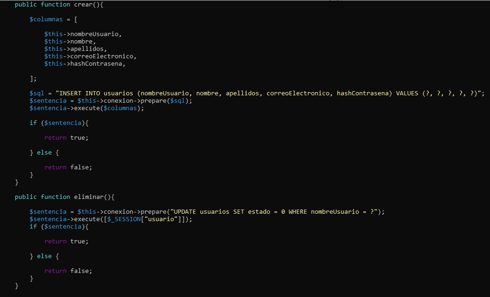

gestionProductos.php
Se obtienen los productos de la BBDD y se muestran en html.
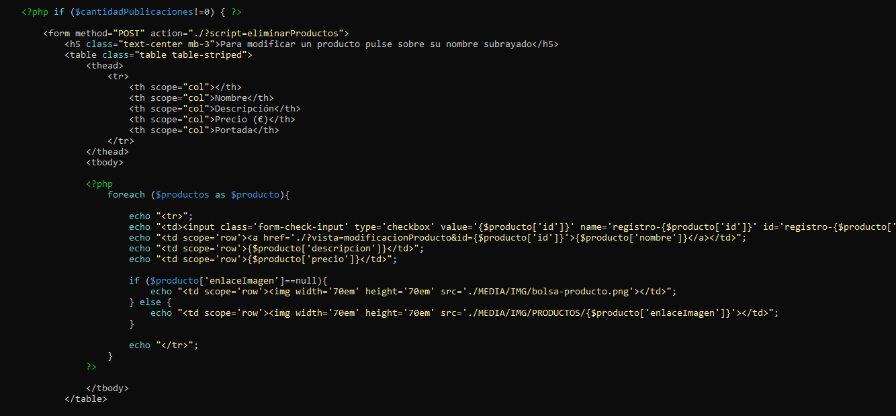

crearMensaje.php
Este script se ejecuta cuando el usuario pulsa sobre el botón de enviar mensaje en un chat.
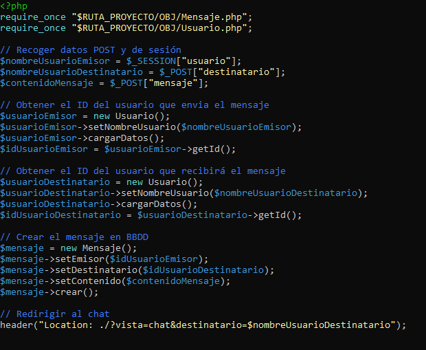

## BB.DD
La base de datos consta de 3 tablas: Usuarios, Productos, Mensajes.
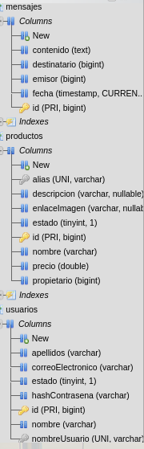
